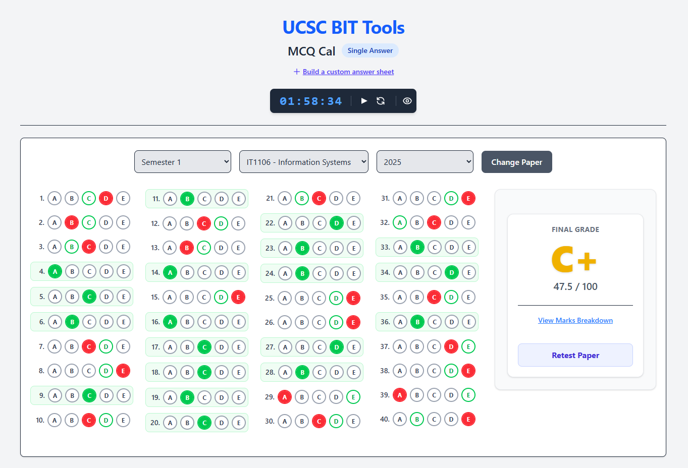

# DiZToolZ - UCSC BIT MCQ Calculator

A lightning-fast, client-side tool designed to help University of Colombo School of Computing (UCSC) BIT students practice and grade their past paper MCQs with precision and ease.



---

## 🚀 About The Project

Studying for UCSC BIT exams involves a lot of past paper practice. However, manually calculating scores, especially for multi-answer questions with negative marking, is tedious, time-consuming, and error-prone. 

**DiZToolZ** solves this problem by providing an interactive, beautiful interface to:
-  Instantly grade your performance on official past papers.
-  Simulate exam conditions with a built-in timer.
-  Create and save your own custom answer sheets for mock exams or study sessions.

Because the entire application runs in your browser (client-side), it's incredibly fast, works offline (after the first load), and your selections are completely private.

---

## ✨ Key Features

- **Accurate UCSC Marking:** Implements the exact grading formula for both Single Answer and Multi-Answer (with negative marking) papers.
- **Instant Grading & Analysis:** Get your final score, university-standard letter grade (A+, B-, E, etc.), and a detailed breakdown of your performance (Full Marks, Partial Marks, Wrong).
- **📝 Custom Paper Builder:** An advanced tool to create your own answer sheets! Define the question count, answer type, time limit, and even add official comments.
- **💾 Local Storage:** Your custom-built papers are saved directly in your browser, ready to use anytime.
- **⏱️ Live Exam Timer:** Practice under pressure with a fully functional timer (`HH:MM:SS`) that starts when you make your first selection. Includes pause, reset, and hide controls.
- **📱 Fully Responsive Design:** The interface adapts beautifully from large desktop monitors to mobile phones, with a unique vertical-column layout for easy scanning.
- **Interactive UI:**
    -  Clean, modern bubble-style inputs.
    -  Immediate visual feedback with solid Green/Red fills for your selected answers.
    -  Subtle hints (green borders) for correct answers you may have missed.
    -  Dynamic display of official paper comments and changes.

---

## 🤔 How This Helps a BIT Student

This tool is purpose-built to address the specific challenges faced by UCSC BIT undergraduates:

1.  **Master the Marking Scheme:** Stop guessing how negative marks are calculated. DiZToolZ shows you exactly how selecting one wrong answer can impact your score on a multi-answer question, helping you build better exam strategies.

2.  **Efficient Practice:** Grade an entire 40-question paper in a single click instead of spending 15 minutes manually checking and calculating. This frees up valuable study time.

3.  **Simulate Real Exam Conditions:** Use the timer to train your speed and accuracy. The clean, distraction-free interface helps you focus just like you would in an exam hall.

4.  **Consolidate Your Study Notes:** Have a set of tricky questions from different tutorials? Use the Custom Paper Builder to create a unique practice sheet for them and test yourself later.

---

## 💻 Tech Stack

-   **[Vite](https://vitejs.dev/):** A blazing-fast, next-generation frontend build tool.
-   **[Tailwind CSS](https://tailwindcss.com/):** A utility-first CSS framework for rapid, custom UI development.
-   **Vanilla JavaScript (ES Modules):** Modern, clean, and efficient JavaScript with no heavy frameworks.

---

## 🤝 How to Contribute

Contributions are what make the open-source community such an amazing place to learn, inspire, and create. Any contributions you make are **greatly appreciated**.

**The most valuable way to contribute is by keeping the past paper answer sheets up-to-date!**

If you have a new answer sheet or find a correction, you can add it by following these steps:

1.  **Fork the Project** on GitHub.
2.  **Locate the JSON files** in the `public/` directory (e.g., `public/sem1/it1106.json`).
3.  **Update or Add a new year entry.** The JSON structure is simple:
    ```json
    "2026": {
        "time" : "2H",
        "answerType": "single", // or "multi"
        "qcount": 40,
        "comments" : "Any official comments or changes go here.",
        "questions": {
            "1": ["c"],
            "2": ["a", "d"], // Multi-answers or single with multiple correct keys
            ...
        }
    }
    ```
4.  **Create a Pull Request** with a clear description of your changes.

Your contribution will help all current and future BIT students. Thank you
